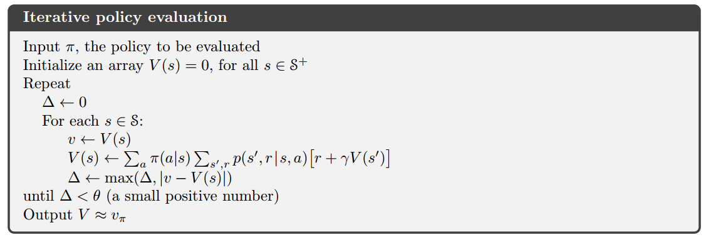
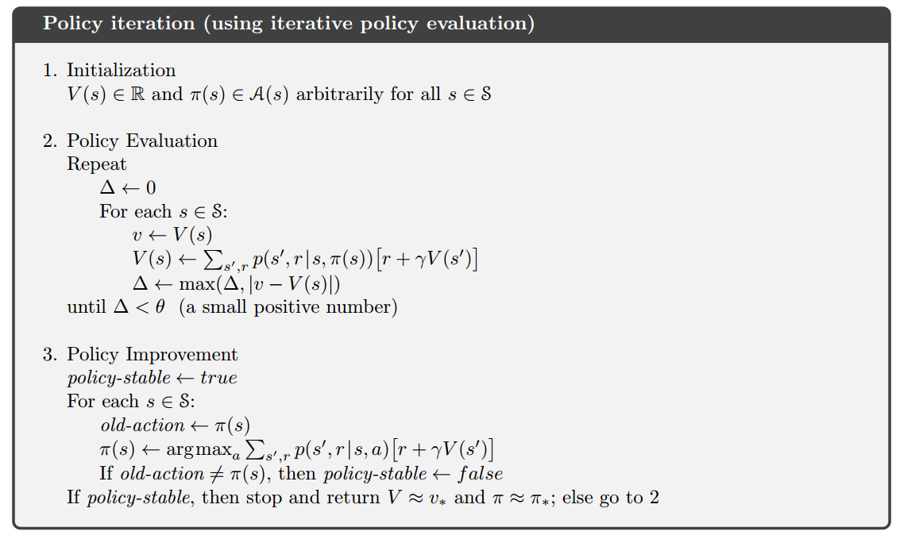
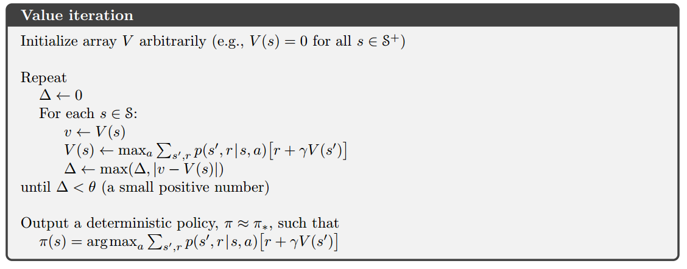

# 动态规划

如何根据Bellman方程使用动态规划来近似计算价值函数($v_\pi,q_\pi,v_*,q_*$)

## 策略评估

根据$v_\pi$的Bellman方程求近似价值函数$V \approx v_\pi$.

`V`可以被看做一个一维数组，`V[i]`表示状态`i`的价值，这就是用表格法表达价值函数。

### 迭代求解

理论上Bellman方程在动态特性$p$已知的情况下可以直接求出解析解，但编写算法求解方程比较繁琐。因此使用迭代法，迭代公式就是Bellman方程。每次迭代产生一个近似值$v_k$，$k\to\infty$时序列$\{v_k\}$能够收敛到$v_\pi$.

$$
v_{k+1}(s) \doteq \sum_a\pi(a|s)\sum_{s',r}p(s',r|s,a)[r + \gamma v_k(s')].
$$

### 就地更新

按照上述公式，需要使用两个数组，一个用于存储旧的价值函数$v_k(s)$，另一个用于存储新的价值函数$v_{k+1}(s)$，后者的值基于前者来计算。

也可以简单地使用就地更新的方法，直接使用新的价值函数替换旧的价值函数，事实上就地更新收敛更快，虽然它更简单。

### 迭代策略评估算法

## 策略改进

对于某个状态$s$，我们想知道是否应该选择一个不同于给定的策略的动作$a \neq \pi(s)$.

### 策略改进定理

一般来说，如果$\pi$和$\pi'$是任意的两个确定的策略，$\forall s \in \mathcal{S}$,

$$
q_\pi(s, \pi'(s)) \geq v_\pi(s).
$$

则称策略$\pi'$相比于$\pi$一样好或更好，且有

$$
\begin{aligned}
v_{\pi'}(s) &\geq v_\pi(s) \\
\pi'(s) &= \argmax_a q_\pi(s,a)
\end{aligned}
$$

假设贪心策略$\pi'$和原有策略$\pi$一样好，但不是更好，则一定有$v_\pi = v_{\pi'}$，则$\forall s \in \mathcal{S}$

$$
v_{\pi'}(s) = \max_a \sum_{s',r}p(s',r|s,a)[r + \gamma v_{\pi'}(s')]
$$

上式与最优Bellman方程完全相同，因此$v_{\pi'}$与$v_*$也完全相同。因此在除了原有策略即为最优策略的情况下，策略改进一定会给出一个更优的结果。

## 策略迭代

### 过程

$$
\pi_0 \stackrel{E}{\longrightarrow}
v_{\pi_0} \stackrel{I}{\longrightarrow}
\pi_1 \stackrel{E}{\longrightarrow}
v_{\pi_1} \stackrel{I}{\longrightarrow}
\pi_2 \stackrel{E}{\longrightarrow}
\dots \stackrel{I}{\longrightarrow}
\pi_{*} \stackrel{E}{\longrightarrow}
v_*
$$

初始时策略为$\pi_0$，通过策略评估得到其价值函数，再通过策略改进得到新的策略$\pi_1$，如此循环，直到得到策略$\pi_*$

### 策略迭代算法

算法分为三个部份，初始化、策略评估和策略改进，策略评估和策略改进交替执行，算法结束的条件是判断策略已经稳定，即$\pi(s) = \pi'(s)$

### Bug

上面的算法有个小bug，如果在两个或多个**同样好**的策略之间不断切换，则条件$\pi(s) = \pi'(s)$可能永远无法成立，算法无法终止。将算法框中的$\text{old-action} \neq \pi(s)$改为$\text{old-action} \notin {a_i}$，其中${a_i}$是所有同样好的策略可能采取的动作的集合。

## 价值迭代

### 截断策略评估

策略迭代的一个缺点是每次都需要进行策略评估，而策略评估本身也是迭代进行的，理论上要在极限处才能收敛到$v_\pi$. 是否必须等策略评估完全收敛后才开始策略改进？

### 个人理解

既然在外层循环为无限循环的条件下，每个状态都可被无限次地访问到，那么策略评估就没有必要在每次外层循环下都迭代到近乎收敛，可以减小策略评估的迭代次数，即提前截断策略评估，依靠外层循环最终也可以使其收敛。

### 特殊情况

策略评估只进行一次迭代，然后直接进行策略改进，这种情况就是**价值迭代**。$\forall s \in \mathcal{S}$，

$$
\begin{aligned}
v_{k+1}(s) &\doteq \max_a\mathbb{E}[R_{t+1} + \gamma v_k(S_{t+1}) | S_t = s, A_t = a] \\
&= \max_a \sum_{s',r}p(s',r|s,a)[r + \gamma v_k(s')]
\end{aligned}
$$

实际上，价值迭代就是使用**最优Bellman方程**来作为更新规则。

### 价值迭代算法

迭代结束后$V$是对$v_*$的估计，利用$V$以及最大化最优Bellman方程的方法可以得到每个状态下最优的动作。

## 异步DP和GPI

### 异步DP

异步DP比价值迭代粒度更细，价值迭代好歹完成了一次对所有状态的价值评估，而异步DP可能只对某些状态进行了价值评估。

### GPI(广义策略迭代)

- 基本思想：只要评估和改进交替进行，不管粒度的粗细，最终的结果通常是相同的，即收敛到最优价值函数和一个最优策略。

- 迭代稳定性：价值函数只有在与当前策略一致时才稳定，策略只有在对当前价值函数是贪心策略时才稳定。两个流程都稳定下来，则最优Bellman方程成立。
