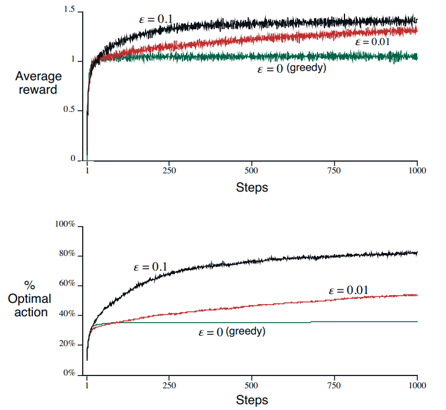

# 多臂赌博机

## 强化学习vs传统机器学习

- 强化学习：**评估**给定动作的好坏
- 传统机器学习：给出正确动作范例来进行直接的**指导**
- **评估性**反馈依赖于当前采取的动作，采取不同的动作会得到不同的反馈
- **指导性**反馈不依赖于当前采取的动作，采取不同的动作都会得到同样的反馈

## k臂赌博机问题

### 问题描述

你要重复地在k个动作中进行选择，每次做出选择后得到一定数值的收益，收益由你选择的动作决定的平稳概率分布产生。你的目标是在某一段时间内最大化总收益的期望。

### 动作收益

k个动作中的每一个在被选择时都有一个期望或者平均收益，称为这个动作的**价值**

$$
q_*(a) \doteq \mathbb{E}[R_t|A_t=a].
$$

### 开发和试探

- 开发：从当前时刻最高估计价值的动作中进行选择，即选择贪心动作，最大化当前收益
- 试探：即选择非贪心动作，虽然没有最大化当前收益，但可能可以最大化长远收益

## 动作-价值方法

### 动作价值的估计（采样平均法）

$$
Q_t(a) = \frac{t时刻前执行动作a得到的收益总和}{t时刻前执行动作a的次数}
$$

### 选择贪心动作

$$
A_t \doteq \argmax_a Q_t(a)
$$

### ε-贪心

- 方法：以ε的概率选择非贪心动作，ε通常是一个很小的值

- ε对平均收益和最优动作的影响

## 动作价值的估计（增量式实现）

采样平均法需要存储过去时刻所有的收益，内存占用和计算量都会随着时间增长。下面将动作价值估计写成递归的形式：

$$
\begin{aligned}
Q_{n+1} &= \frac{1}{n}\sum_{i=1}^{n} R_i \\
        &= \frac{1}{n}(R_n + \sum_{i=1}^{n-1} R_i) \\
        &= \frac{1}{n}(R_n + (n-1)\frac{1}{(n-1)}\sum_{i=1}^{n-1} R_i) \\
        &= \frac{1}{n}(R_n + (n-1)Q_{n}) \\
        &= \frac{1}{n}(R_n + nQ_{n} - Q_{n}) \\
        &= Q_n + \frac{1}{n}[R_n - Q_n]
\end{aligned}
$$

此时得到了动作价值估计的增量式实现

$$
新估计值\leftarrow旧估计值+步长\times[目标-旧估计值]
$$

## 非平稳问题

当收益的**概率分布**随时间变化时，需要对于近期收益赋予比过去收益更高的权重，重点考虑的是当前的概率分布而不是过去的。将步长设为常数是一种方法。

$$
Q_{n+1} = Q_n + \alpha[R_n-Q_n]
$$

需要注意这是有偏估计

$$
Q_{n+1} = \dots = (1-a)^nQ_1 + \sum_{i=1}^n\alpha(1-\alpha)^{n-i}R_i
$$

## 乐观初始值

将每个动作的初始价值设置为显然大于其真实价值，此时不管选择哪个动作，其估计价值都会下降，从而机器会选择其他动作，这样一来所有动作都被选择了一次。**乐观初始值是一种鼓励试探的方法**。

## UCB

### ε-贪心的问题

非贪心时的选择是盲目的（完全随机的）

### UCB选择动作的方法

$$
A_t \doteq \argmax_a [Q_t(a)+c\sqrt{\frac{\ln t}{N_t(a)}}]
$$

其中$N_t(a)$表示时刻$t$之前动作$a$被选择的次数，$c$是一个常数，控制动作$a$被选择的次数。当$N_t(a)$为0时，选择动作$a$

### UCB的含义

UCB认为越长时间不被选择的动作，其不确定性越大，因此在下一次选择时也更倾向于选择该动作。从公式可以看出，动作之前被选中次数越少，UCB项中分母越小，UCB项越大，当前被选中的概率也越大。

## 策略梯度算法

$$
\begin{aligned}
H_{t+1}(A_t) &\doteq H_{t}(A_t) + \alpha(R_t-\bar{R}_t)(1-\pi_t(A_t))， 以及\\
H_{t+1}(a) &\doteq H_{t}(a) + \alpha(R_t-\bar{R}_t)\pi_t(a), 对所有a\neq A_t
\end{aligned}
$$

其中$H_t$是偏好函数，满足以下定义

$$
\Pr\{A_t=a\} \doteq \frac{e^{H_t(a)}}{\sum_{b=1}^k e^{H_t(b)}} \doteq \pi_t(a)
$$

## 上下文相关

赌博机问题没有考虑环境的状态，采取的动作与情景没有联系。假如能得到一些线索，例如赌博机灯的颜色，在颜色改变的同时改变选择动作的概率分布，即根据环境的状态来更改策略。
