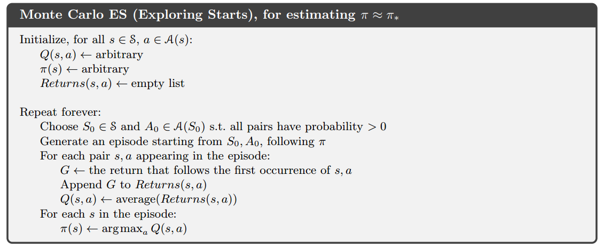
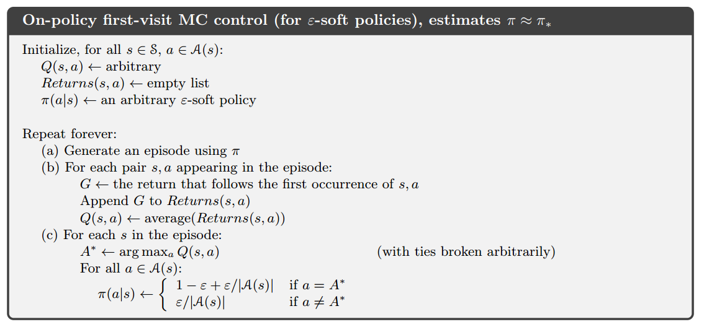

# 蒙特卡洛方法

- 蒙特卡洛简称MC
- 前提：未知环境的动态特性，只能从经验中学习
- 经验：从真实或者模拟的环境交互中采样得到的状态、动作、收益的序列
- 真实经验：不需要模型，直接与环境交互即可（无模型）
- 模拟经验：需要一个**样本模型**而不是**分布模型**来生成状态转移的一些样本（有模型）

## MC预测

### 首次访问型MC算法

取状态$s$在每个episode中首次出现时刻的回报，并以这些回报的平均值作为状态$s$的价值的估计。

### 每次访问型MC算法

取状态$s$在每个episode中每次出现时刻的回报，并以这些回报的平均值作为状态$s$的价值的估计。

### 回溯图

|||
|:-:|:-:|
|MC回溯图|DP回溯图|

MC回溯图只包括真实的转移，DP回溯图包含了所有可能的转移，这一差异的根本就是环境的动态特性是否已知。

## 动作价值的MC估计

在了解环境动态特性的前提下，单靠状态价值函数就能确定一个策略（利用最优Bellman方程），但在MC中无法这样做，因此需要对动作价值进行MC估计

### 收敛条件

**在对每个“状态-动作”二元组的访问次数趋向无穷时**，MC方法对动作价值的估计会收敛到动作价值函数的真实期望。

### 保证试探性

当$\pi$为确定性策略时，根据策略$\pi$产生的episode序列可能有些“状态-动作”二元组永远不会被访问到，则收敛性无法保证。因此，此处先假设episode是**试探性出发**的。

## MC控制

### 遵循GPI

$$
\pi_0 \stackrel{E}{\longrightarrow}
q_{\pi_0} \stackrel{I}{\longrightarrow}
\pi_1 \stackrel{E}{\longrightarrow}
q_{\pi_1} \stackrel{I}{\longrightarrow}
\pi_2 \stackrel{E}{\longrightarrow}
\dots \stackrel{I}{\longrightarrow}
\pi_{*} \stackrel{E}{\longrightarrow}
q_*
$$

与第四章中提到的GPI相比：

- 评估：计算动作价值而非状态价值；基于经验而非基于分布模型
- 改进：策略是基于Q函数(动作价值函数)的贪心策略，更新Q函数即改进了策略

### 应用策略改进定理

$$
\begin{aligned}
q_{\pi_k}(s,\pi_{k+1}(s)) &= q_{\pi_k}(s,\argmax_a q_{\pi_k}(s,a)) \\
&= \max_aq_{\pi_k}(s,a)
\end{aligned}
$$

如果$\pi_{k+1}$一定不比$\pi_k$差，则动作$\pi_{k+1}(s)$一定是$q_{\pi_k}(s,\cdot)$中最好的，即$\argmax_a q_{\pi_k}(s,a)$

### 基于试探出发假设的MC控制算法

注意，该算法必须基于试探性出发的假设，否则无法收敛，去除该假设无法实现算法。

## 去除试探性出发假设

为了推广MC控制算法至一般情况下都能使用，应当去除**试探性出发**的假设

### on-policy和off-policy

在MC中根据用途分类有两种策略

- 用于生成采样数据序列的策略
- 用于实际决策的待评估和改进的策略

如果这两种策略是同一个策略，则该算法是on-policy的，否则是off-policy的

### 去除假设

上一节的MC控制算法中，策略是“硬性”的，即贪心策略，不存在试探，因此存在“状态-动作”二元组访问不到的情况。为了解决这一问题，将策略改为“软性”的即可，即ε-贪心策略。以下对比两种策略：

#### ε-贪心策略

- 非贪心动作被选择的概率：$\frac{\epsilon}{|\mathcal{A}(s)|}$
- 贪心动作被选择的概率：$1-\epsilon+\frac{\epsilon}{|\mathcal{A}(s)|}$
- $|\mathcal{A}(s)|$是$\mathcal{A}(s)$中动作的数量
- 策略函数为$\pi: \mathcal{S} \mapsto \mathcal{A}$，$\pi(s)$表示状态$s$下应选择的动作

#### 贪心策略

- 选择贪心动作的概率：1
- 策略函数为$\pi: \mathcal{S} \times \mathcal{A} \mapsto [0,1]$，$\pi(a|s)$表示状态$s$下选择动作$a$的概率

### On-policy MC控制算法

该算法实现时与算法5-3的主要区别是$\pi$不再是存储动作的一维数组，而是存储概率的二维数组。

||硬性策略MC控制|软性策略MC控制|
|:-:|:-:|:-:|
|$\pi$的实现|$$[a_0,a_1,a_2,a_3,...]$$|$$\begin{aligned}[&[p_{0,0},p_{0,1},p_{0,2},...&],\\&[p_{1,0},p_{1,1},p_{1,2},...&],\\&[p_{2,0},p_{2,1},p_{2,2},...&],\\&...&]\end{aligned}$$|

## 基于重要度采样的Off-policy
