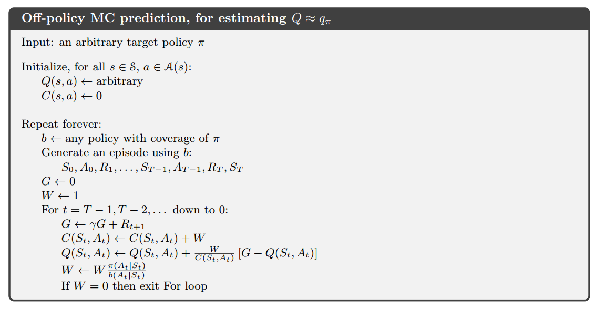
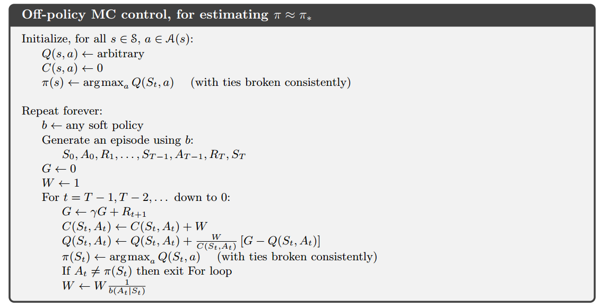

# 蒙特卡洛方法

- 蒙特卡洛简称MC
- 前提：未知环境的动态特性，只能从经验中学习
- 经验：从真实或者模拟的环境交互中采样得到的状态、动作、收益的序列
- 真实经验：不需要模型，直接与环境交互即可（无模型）
- 模拟经验：需要一个**样本模型**而不是**分布模型**来生成状态转移的一些样本（有模型）

## MC预测

### 首次访问型MC算法

取状态$s$在每个episode中首次出现时刻的回报，并以这些回报的平均值作为状态$s$的价值的估计。

### 每次访问型MC算法

取状态$s$在每个episode中每次出现时刻的回报，并以这些回报的平均值作为状态$s$的价值的估计。

### 回溯图

|||
|:-:|:-:|
|MC回溯图|DP回溯图|

MC回溯图只包括真实的转移，DP回溯图包含了所有可能的转移，这一差异的根本就是环境的动态特性是否已知。

## 动作价值的MC估计

在了解环境动态特性的前提下，单靠状态价值函数就能确定一个策略（利用最优Bellman方程），但在MC中无法这样做，因此需要对动作价值进行MC估计

### 收敛条件

**在对每个“状态-动作”二元组的访问次数趋向无穷时**，MC方法对动作价值的估计会收敛到动作价值函数的真实期望。

### 保证试探性

当$\pi$为确定性策略时，根据策略$\pi$产生的episode序列可能有些“状态-动作”二元组永远不会被访问到，则收敛性无法保证。因此，此处先假设episode是**试探性出发**的。

## MC控制

### 遵循GPI

$$
\pi_0 \stackrel{E}{\longrightarrow}
q_{\pi_0} \stackrel{I}{\longrightarrow}
\pi_1 \stackrel{E}{\longrightarrow}
q_{\pi_1} \stackrel{I}{\longrightarrow}
\pi_2 \stackrel{E}{\longrightarrow}
\dots \stackrel{I}{\longrightarrow}
\pi_{*} \stackrel{E}{\longrightarrow}
q_*
$$

与第四章中提到的GPI相比：

- 评估：计算动作价值而非状态价值；基于经验而非基于分布模型
- 改进：策略是基于Q函数(动作价值函数)的贪心策略，更新Q函数即改进了策略

### 应用策略改进定理

$$
\begin{aligned}
q_{\pi_k}(s,\pi_{k+1}(s)) &= q_{\pi_k}(s,\argmax_a q_{\pi_k}(s,a)) \\
&= \max_aq_{\pi_k}(s,a)
\end{aligned}
$$

如果$\pi_{k+1}$一定不比$\pi_k$差，则动作$\pi_{k+1}(s)$一定是$q_{\pi_k}(s,\cdot)$中最好的，即$\argmax_a q_{\pi_k}(s,a)$

### 基于试探出发假设的MC控制算法

注意，该算法必须基于试探性出发的假设，否则无法收敛，去除该假设无法实现算法。

## 去除试探性出发假设

为了推广MC控制算法至一般情况下都能使用，应当去除**试探性出发**的假设

### on-policy和off-policy

在MC中根据用途分类有两种策略

- 用于生成采样数据序列的策略
- 用于实际决策的待评估和改进的策略

如果这两种策略是同一个策略，则该算法是on-policy的，否则是off-policy的

### 去除假设

上一节的MC控制算法中，策略是“硬性”的，即贪心策略，不存在试探，因此存在“状态-动作”二元组访问不到的情况。为了解决这一问题，将策略改为“软性”的即可，即ε-贪心策略。以下对比两种策略：

#### ε-贪心策略

- 非贪心动作被选择的概率：$\frac{\epsilon}{|\mathcal{A}(s)|}$
- 贪心动作被选择的概率：$1-\epsilon+\frac{\epsilon}{|\mathcal{A}(s)|}$
- $|\mathcal{A}(s)|$是$\mathcal{A}(s)$中动作的数量
- 策略函数为$\pi: \mathcal{S} \mapsto \mathcal{A}$，$\pi(s)$表示状态$s$下应选择的动作

#### 贪心策略

- 选择贪心动作的概率：1
- 策略函数为$\pi: \mathcal{S} \times \mathcal{A} \mapsto [0,1]$，$\pi(a|s)$表示状态$s$下选择动作$a$的概率

### On-policy MC控制算法

该算法实现时与算法5-3的主要区别是$\pi$不再是存储动作的一维数组，而是存储概率的二维数组。

||硬性策略MC控制|软性策略MC控制|
|:-:|:-:|:-:|
|$\pi$的实现|$$[a_0,a_1,a_2,a_3,...]$$|$$\begin{aligned}[&[p_{0,0},p_{0,1},p_{0,2},...&],\\&[p_{1,0},p_{1,1},p_{1,2},...&],\\&[p_{2,0},p_{2,1},p_{2,2},...&],\\&...&]\end{aligned}$$|

## 基于重要度采样的Off-policy

### 两种策略

- 目标策略：用来评估和学习的策略
- 行动策略：用于生成行动样本的策略
- 可将On-policy视为目标策略和行动策略相同的特殊的Off-policy

### Off-policy学习

#### 描述

给定目标策略$\pi$和行动策略$b$ ($b\neq\pi$)，希望通过策略$b$生成的样本序列来预测$v_\pi$或$q_\pi$.

#### 覆盖假设

$$\forall \pi(a|s)>0, b(a|s)>0$$

在$\pi$中可能发生的每个动作必须在$b$中也可能发生，否则无法单纯依靠$b$生成的序列来预测$\pi$的价值.

### 重要度采样

给定来自其他分布的样本($b$)的条件下，估计某种分布的期望值($\pi$)。

给定起始状态$S_t$，后续状态-动作轨迹$A_t,S_{t+1},A_{t+1},...,S_T$在策略$\pi$下发生的概率是

$$
\begin{aligned}
&\Pr\{A_t,S_{t+1},A_{t+1},...,S_T|S_t,A_{t:T-1}\sim\pi\} \\
&=\pi(A_t|S_t)p(S_{t+1}|S_t,A_t)\pi(A_{t+1}|S_{t+1})\dots p(S_T|S_{T-1},A_{T-1}) \\
&=\prod_{k=t}^{T-1}\pi(A_k|S_k)p(S_{k+1}|S_k,A_k)
\end{aligned}
$$

其中$p$是对收益积分后的动态特性函数。同理在策略$b$下发生的概率为

$$
\prod_{k=t}^{T-1}b(A_k|S_k)p(S_{k+1}|S_k,A_k)
$$

目标策略和行动策略轨迹下的相对概率（即重要度采样比）是

$$
\rho_{t:T-1} \doteq
\frac{\prod_{k=t}^{T-1}\pi(A_k|S_k)p(S_{k+1}|S_k,A_k)}{\prod_{k=t}^{T-1}b(A_k|S_k)p(S_{k+1}|S_k,A_k)}
= \prod_{k=t}^{T-1}\frac{\pi(A_k|S_k)}{b(A_k|S_k)}
$$

因此，重要度采样比与动态特性无关，只与两个策略和样本序列数据相关。

### 利用重要度采样比

重要度采样比反映了一个episode在策略$\pi$和$b$下发生的概率之比，因此可以使用重要度采样比将行动策略的收益调整为目标策略的收益。

$$
\begin{aligned}
v_b(s) &= \mathbb{E}[G_t | S_t=s] \\
v_\pi(s) &= \mathbb{E}[\rho_{t:T-1}G_t | S_t=s] \\
\end{aligned}
$$

#### 普通重要度采样

$$
V(s) \doteq \frac{\sum_{t\in\mathcal{T}(s)}\rho_{t:T(t)-1}G_t}{|\mathcal{T}(s)|}
$$

其中$\mathcal{T}(s)$表示所有访问过状态$s$的时刻的集合，$T(t)$表示时刻$t$后的首次终止时刻

#### 加权重要度采样

$$
V(s) \doteq \frac{\sum_{t\in\mathcal{T}(s)}\rho_{t:T(t)-1}G_t}{\sum_{t\in\mathcal{T}(s)}\rho_{t:T(t)-1}}
$$

#### 对比

||普通重要度采样|加权重要度采样|
|:-:|:-:|:-:|
|**偏差**|无偏估计|有偏估计|
|**方差**|无界|有界|
|**反映程度**|能很好地反映目标策略，但也会离观测值很远|能反映目标策略，也不会离观测值很远|
|**极端情况**|$\rho_{t:T(t)-1}$很大或很小，则估计值和观测值相差很大|只观测了一个episode，则估计值等于观测值|

## 增量式实现

### On-policy

假设有一个回报序列$G_1,G_2,\dots,G_{n-1}$，它们都从相同的状态开始

- 普通实现

$$
V_n \doteq \frac{\sum_{k=1}^{n-1}G_k}{n-1}
$$

- 增量式实现

$$
V_{n+1} \doteq V_n + \frac{1}{n}[G_n - V_n]
$$

### Off-policy (加权重要度采样)

假设有一个回报序列$G_1,G_2,\dots,G_{n-1}$，它们都从相同的状态开始，且每一个回报都对应一个随即权重$W_i$

- 普通实现

$$
V_n \doteq \frac{\sum_{k=1}^{n-1}W_kG_k}{\sum_{k=1}^{n-1}W_k}
$$

- 增量式实现

$$
\begin{aligned}
V_{n+1} &\doteq V_n + \frac{W_n}{C_n}[G_n - V_n] \\
C_{n+1} &\doteq C_n + W_{n+1}
\end{aligned}
$$

### Off-policy MC预测算法

使用了Off-policy的增量式实现来估计$Q\approx q_*$

## Off-policy MC控制

在算法5-6的基础上增加一个确定的目标策略函数，用来估计$\pi\approx\pi_*$

### Off-policy MC控制算法

最后一行使用$W\leftarrow W\frac{1}{b(A_t|S_t)}$是因为$\pi$是确定性策略，$\pi(A_t|S_t) = 1$
