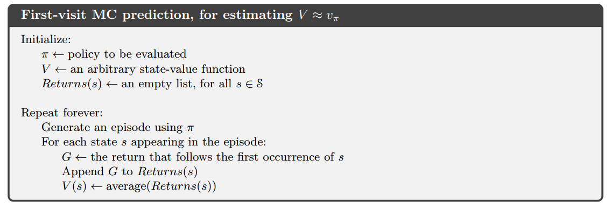
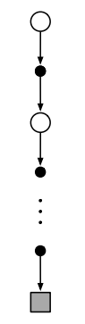
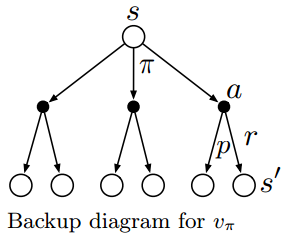

# 蒙特卡洛方法

- 蒙特卡洛简称MC
- 前提：未知环境的动态特性，只能从经验中学习
- 经验：从真实或者模拟的环境交互中采样得到的状态、动作、收益的序列
- 真实经验：不需要模型，直接与环境交互即可（无模型）
- 模拟经验：需要一个**样本模型**而不是**分布模型**来生成状态转移的一些样本（有模型）

## MC预测

### 首次访问型MC算法

取状态$s$在每个episode中首次出现时刻的回报，并以这些回报的平均值作为状态$s$的价值的估计。

### 每次访问型MC算法

取状态$s$在每个episode中每次出现时刻的回报，并以这些回报的平均值作为状态$s$的价值的估计。

### 回溯图

|||
|:-:|:-:|
|MC回溯图|DP回溯图|

MC回溯图只包括真实的转移，DP回溯图包含了所有可能的转移，这一差异的根本就是环境的动态特性是否已知。

## 动作价值的MC估计

在了解环境动态特性的前提下，单靠状态价值函数就能确定一个策略（利用最优Bellman方程），但在MC中无法这样做，因此需要对动作价值进行MC估计

### 收敛条件

**在对每个“状态-动作”二元组的访问次数趋向无穷时**，MC方法对动作价值的估计会收敛到动作价值函数的真实期望。

### 保证试探性

当$\pi$为确定性策略时，根据策略$\pi$产生的episode序列可能有些“状态-动作”二元组永远不会被访问到，则收敛性无法保证。因此，此处先假设episode是**试探性出发**的。

## MC控制
