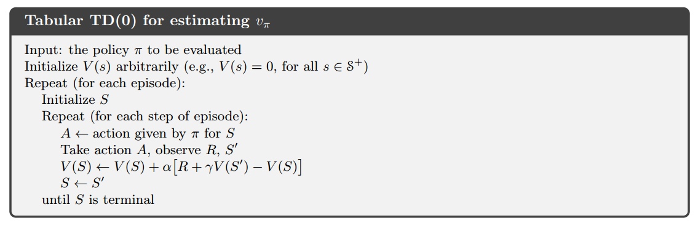
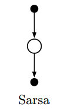
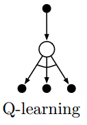
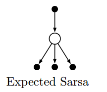
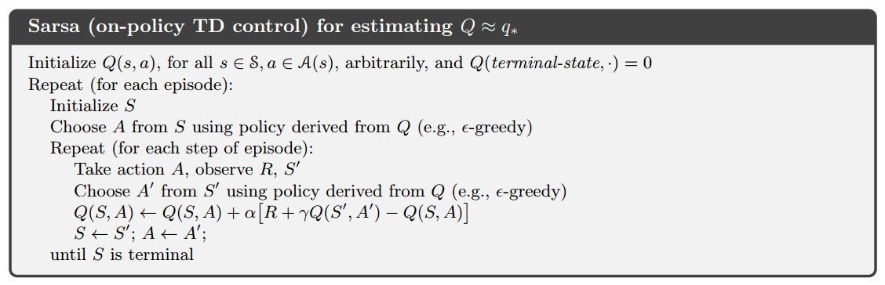
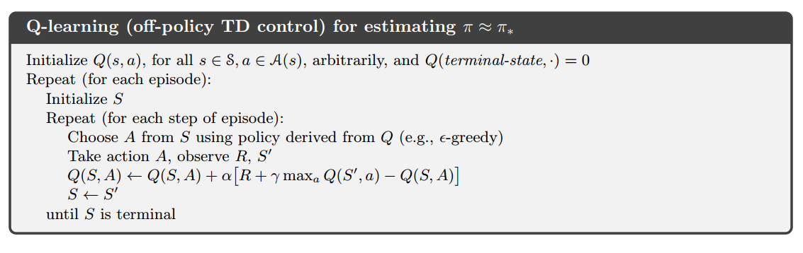
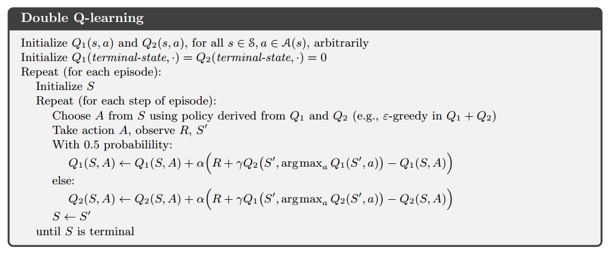

# 时序差分学习

||DP|MC|TD|
|:-:|:-:|:-:|:-:|
|**学习基础**|动态特性|经验|经验|
|**是否自举**|是|否|是|
|**更新公式**|贝尔曼方程|$V(S_t)=V(S_t)+\alpha[G_t - V(S_t)]$|$V(S_t)=V(S_t)+\alpha[R_{t+1} + \gamma V(S_{t+1}) - V(S_t)]$|

## TD预测

### TD与MC的对比

- MC: 必须等到episode结束才能确定$V(S_t)$的增量
- TD: 只需要等到下一时刻，使用$R_{t+1} + \gamma V(S_{t+1})$来近似$G_t$

### TD(0)算法

### TD误差

$$
\delta_t \doteq R_{t+1} + \gamma V(S_{t+1}) - V(S_t)
$$

$$
\begin{aligned}
G_t - V(S_t) &= R_{t+1} + \gamma G_{t+1} - V(S_t) + \gamma V(S_{t+1}) - \gamma V(S_{t+1}) \\
&= \delta_t + \gamma(G_{t+1} - V(S_{t+1})) \\
&= \delta_t + \gamma \delta_{t+1} + \gamma^2(G_{t+1} - V(S_{t+2})) \\
&= \sum_{k=t}^{T-1}\gamma^{k-t}\delta_k
\end{aligned}
$$

## TD的优势

- 在线学习，不需要等到episode结束，也适用于持续性任务
- 在随机任务上通常比常量$\alpha$ MC方法收敛更快

## TD(0)的最优性

### 举例

对于以下8个episodes

- A0B0
- B1
- B1
- B1
- B1
- B1
- B1
- B0

||MC|TD(0)|
|:-:|:-:|:-:|
|V(A)|3/4|3/4|
|V(B)|0|3/4|

### 结论

- MC对一个状态价值的估计独立于其他状态，而TD(0)则依赖于其他状态
- MC方法找出的是最小化训练集上均方误差的估计
- 批量TD(0)找出的是完全符合马尔可夫过程模型的最大似然估计参数

## Sarsa vs. Q-Learning vs. 期望Sarsa

||Sarsa|Q-Learning|期望Sarsa|
|:-:|:-:|:-:|:-:|
|更新公式|[1]|[2]|[3]|
|回溯图||||
|Policy|On-policy|Off-policy|On-policy|
|算法|||-|

[1] $Q(S_t, A_t) \leftarrow Q(S_t, A_t) + \alpha[R_{t+1} + \gamma Q(S_{t+1}, A_{t+1}) - Q(S_t, A_t)]$
[2] $Q(S_t, A_t) \leftarrow Q(S_t, A_t) + \alpha[R_{t+1} + \gamma \max_a Q(S_{t+1}, a) - Q(S_t, A_t)]$
[3] $Q(S_t, A_t) \leftarrow Q(S_t, A_t) + \alpha[R_{t+1} + \gamma \sum_a \pi(a|S_{t+1})Q(S_{t+1}, a) - Q(S_t, A_t)]$

## 双Q学习

### 最大化偏差

假设在状态s下可以选择多个动作a，这些动作在该状态下的真实价值$q(s,a)$全为0，但是它们的估计值$Q(s,a)$是不确定的，可能有的大于0有的小于0，因此估计值的最大值是正数，因而产生了偏差。这个偏差叫“最大化偏差”，原因是它是在最大化估计值的过程中产生的。

### 偏差产生的原因

以下两个过程：

- 确定价值最大的动作
- 估计该动作的价值

采用了同样的样本，则会产生偏差。例如先使用$\argmax_a Q(s,a)$找出价值最大的动作，并直接用$\max_a Q(s,a)$作为最大价值。

### 双学习思想

- 思想：先使用$a_{max} \leftarrow \argmax_a Q_1(s,a)$找出价值最大的动作，然后用$Q_2(s, a_{max})$作为最大价值，化简后最大价值位$Q_2(s, \argmax_a Q_1(s,a))$

- 更新公式：
$$
Q_1(S_t, A_t) \leftarrow Q_1(S_t, A_t) + \alpha[R_{t+1} + \gamma Q_2(S_{t+1}, \argmax_a Q_1(S_{t+1}, a)) - Q_1(S_t, A_t)]
$$

### 双Q学习算法

